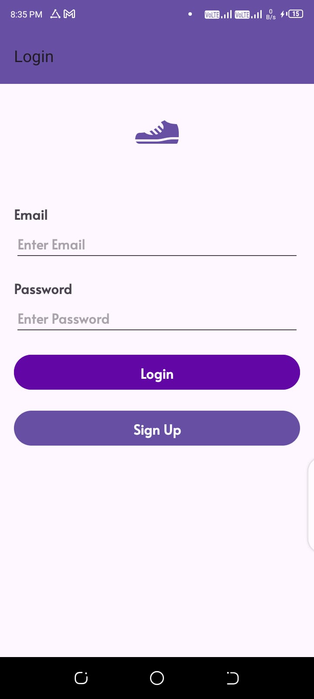
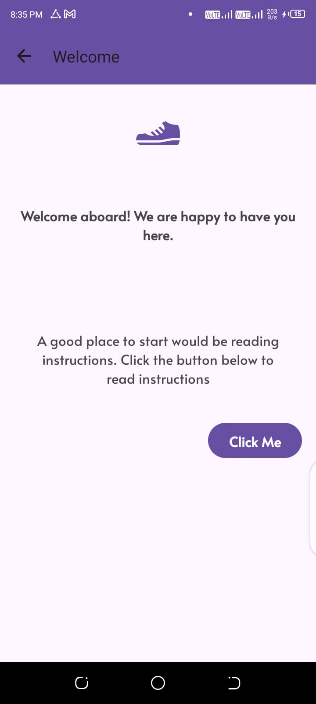
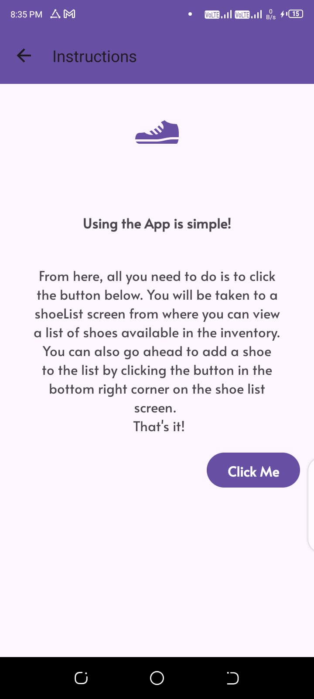
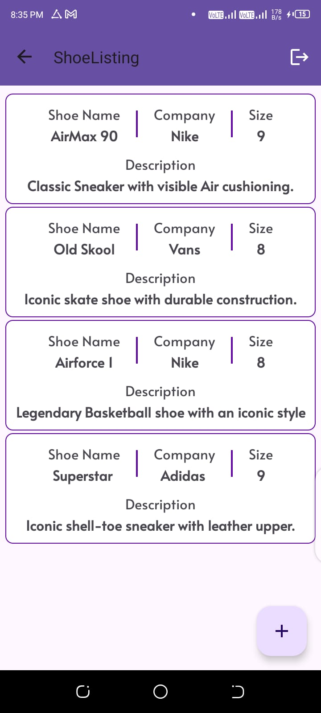
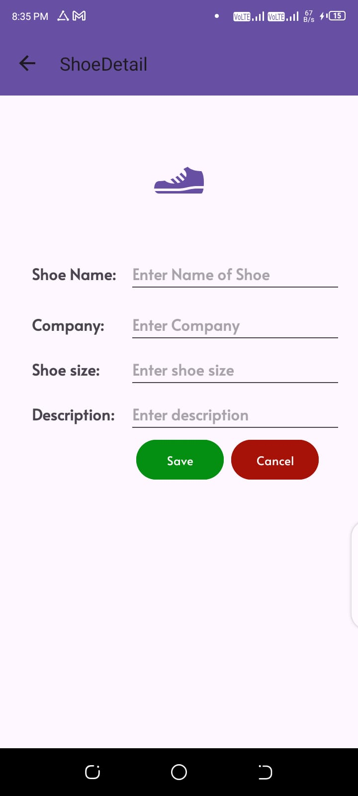

# Shoe Store App
>App keeps an inventory for shoes in the store.

### Rationale
> The App is inspired by The [Android Kotlin Developer Nanodegree Course](https://www.udacity.com/enrollment/nd940/2.0.9) on Udacity.
> It's the [first](https://github.com/udacity/nd940-android-kotlin-course1-starter/tree/master/starter) of the four projects in the course. 

### Tools and Libraries
* [Data Binding](https://developer.android.com/topic/libraries/data-binding) - a support library that allows you to bind UI components in your layouts to data sources in your app using a declarative format rather than programmatically.
* [Navigation](https://developer.android.com/jetpack/androidx/releases/navigation) - a framework for navigating between 'destinations' within an Android application
* [ViewModel](https://developer.android.com/topic/libraries/architecture/viewmodel) -  is a business logic or screen level state holder. It exposes state to the UI and encapsulates related business logic. Its principal advantage is that it caches state and persists it through configuration changes.
* [LiveData](https://developer.android.com/topic/libraries/architecture/livedata) - an observable data holder class. Unlike a regular observable, LiveData is lifecycle-aware, meaning it respects the lifecycle of other app components, such as activities, fragments, or services.

### Screenshots
|  |  |  |
|:-----------------------------------------:|:-----------------------------------------:|:-----------------------------------------:|
|  |  |